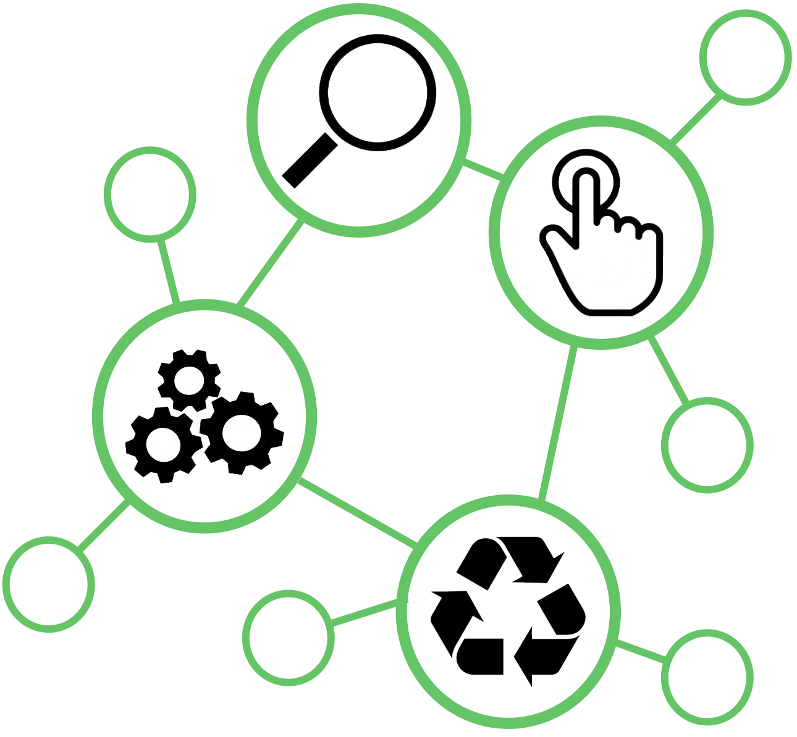

=======================================================
fairgraph: a Python API for the EBRAINS Knowledge Graph
=======================================================

**fairgraph** is a Python library for working with metadata
in the EBRAINS Knowledge Graph, with a particular focus on data reuse,
although it is also useful in metadata registration/curation.




.. toctree::
   :maxdepth: 1
   :caption: Contents:

   installation
   knowledgegraph
   queries
   creatingupdating
   modules
   permissions
   api_reference
   contributing
   gettinghelp
   authors
   release_notes

Quickstart
==========

Installation
------------

To get the latest release::

   pip install fairgraph

To get the development version::

   git clone https://github.com/HumanBrainProject/fairgraph.git
   pip install -U ./fairgraph


Basic setup
-----------

The basic idea of the library is to represent metadata nodes from the Knowledge Graph as Python objects.
Communication with the Knowledge Graph service is through a client object,
for which an access token associated with an EBRAINS account is needed::

   >>> from fairgraph import KGClient

   >>> client = KGClient()

If you are working in an EBRAINS Lab Jupyter notebook,
the client will take its access token from the notebook automatically.

If working outside the Lab, the client will print the URL of a log-in page.
You should open this URL in a web-browser, log in to your EBRAINS account,
then close the tab and return to your Python prompt or your notebook.

For other ways to provide/obtain an access token, see :doc:`queries`.


Retrieving metadata from the Knowledge Graph
--------------------------------------------

The different metadata/data types available in the Knowledge Graph are grouped into submodules
within the `openminds` module.
For example::

   >>> from fairgraph.openminds.core import DatasetVersion

Using these classes, it is possible to list all metadata matching a particular criterion, e.g.::

   >>> datasets = DatasetVersion.list(client, from_index=10, size=10)

If you know the unique identifier of an object, you can retrieve it directly::

   >>> dataset_of_interest = DatasetVersion.from_id("17196b79-04db-4ea4-bb69-d20aab6f1d62", client)
   >>> dataset_of_interest.show()
   id                       https://kg.ebrains.eu/api/instances/17196b79-04db-4ea4-bb69-d20aab6f1d62
   space                    dataset
   type                     https://openminds.om-i.org/types/DatasetVersion
   accessibility            KGProxy([ProductAccessibility], id="b2ff7a47-b349-48d7-8ce4-cf51868675f1")
   data_types               KGProxy([SemanticDataType], id="f468ee45-37a6-4e71-8b70-0cbe66d367db")
   description
   digital_identifier       KGProxy([DOI, IdentifiersDotOrgID], id="c03106e1-1f30-446b-8439-ce77fc8358d6")
   ethics_assessment        KGProxy([EthicsAssessment], id="a217a2f8-dcb8-4ca9-9923-517af2aebc5b")
   experimental_approaches  [KGProxy([ExperimentalApproach], id="4ccfa2b8-fe75-4a17-98b7-e01b922c8f03"), KGProxy([Experim ...
   full_documentation       KGProxy([DOI, File, ISBN, WebResource], id="d6cd3981-cdb1-460c-a4e4-29458fe0a47f")
   full_name                Whole cell patch-clamp recordings of cerebellar Golgi cells
   keywords                 [KGProxy([ActionStatusType, AgeCategory, AnalysisTechnique, AnatomicalAxesOrientation, Anatom ...
   license                  KGProxy([License, WebResource], id="6ebce971-7f99-4fbc-9621-eeae47a70d85")
   preparation_designs      KGProxy([PreparationType], id="9f3abe1b-af7c-446d-b637-6a4f19ab7939")
   related_publications     [KGProxy([DOI, HANDLE, ISBN, ISSN, Book, Chapter, ScholarlyArticle], id="477b3e5d-5903-4a68-8 ...
   release_date             2020-03-26
   repository               KGProxy([FileRepository], id="80e2ca84-b9fa-43b7-b21a-b5f99d89f051")
   short_name               Whole cell patch-clamp recordings of cerebellar Golgi cells
   studied_specimens        [KGProxy([Subject, SubjectGroup, TissueSample, TissueSampleCollection], id="7713a42e-0499-405 ...
   study_targets            [KGProxy([AuditoryStimulusType, BiologicalOrder, BiologicalSex, BreedingType, CellCultureType ...
   techniques               [KGProxy([AnalysisTechnique, MRIPulseSequence, MRIWeighting, StimulationApproach, Stimulation ...
   version_identifier       v1
   version_innovation       This is the first version of this research product.


The associated metadata are accessible as attributes of the Python objects, e.g.::

   >>> print(dataset_of_interest.short_name)
   Whole cell patch-clamp recordings of cerebellar Golgi cells


You can also download any associated data::

   >>> dataset_of_interest.download(client, "local_directory")


Inherited attributes
````````````````````

For :class:`DatasetVersion` and other research product versions, certain metadata like name, description, and authors
may not be available directly, but can be inherited from the parent :class:`Dataset`. For example::

   >>> dataset_of_interest.description
   ''
   >>> dataset_of_interest.get_description(client)
   'The Golgi cells, together with granule cells and mossy fibers, form a neuronal microcircuit regulating information
    transfer at the cerebellum input stage. In order to further investigate the Golgi cells properties and their excitatory
    synapses, whole-cell patch-clamp recordings were performed on acute parasagittal cerebellar slices obtained
    from juvenile GlyT2-GFP mice (p16-p21). Passive Golgi cells parameters were extracted in voltage-clamp mode by
    analyzing current relaxation induced by step voltage changes (IV protocol). Excitatory synaptic transmission
    properties were investigated by electrical stimulation of the mossy fibers bundle (5 pulses at 50 Hz, EPSC protocol,
    voltage-clamp mode).'

Following links in the knowledge graph
``````````````````````````````````````

Links between metadata in the Knowledge Graph are not followed automatically,
to avoid unnecessary network traffic.
Instead the property is set to a :class:`KGProxy` object, representing a link::

   >>> dataset_of_interest.license
   KGProxy([License, WebResource], id="6ebce971-7f99-4fbc-9621-eeae47a70d85")

This link can be followed with the :meth:`resolve()` method::

   >>> dataset_license = dataset_of_interest.license.resolve(client)
   >>> dataset_license.show()
   id          https://kg.ebrains.eu/api/instances/6ebce971-7f99-4fbc-9621-eeae47a70d85
   space       controlled
   type        https://openminds.om-i.org/types/License
   full_name   Creative Commons Attribution Non Commercial Share Alike 4.0 International
   legal_code  https://creativecommons.org/licenses/by-nc-sa/4.0/legalcode
   short_name  CC-BY-NC-SA-4.0
   webpages    ['https://creativecommons.org/licenses/by-nc-sa/4.0', 'https://spdx.org/licenses/CC-BY-NC-SA-4.0.html']


If you know in advance which links you wish to follow, you can use the `follow_links` option::

   >>> dataset = DatasetVersion.from_id(
   ...     "17196b79-04db-4ea4-bb69-d20aab6f1d62",
   ...     client,
   ...     follow_links={
   ...         "license": {},
   ...         "is_version_of": {
   ...             "authors": {}
   ...         }
   ...     }
   ... )
   >>> dataset.is_version_of[0].authors[0].given_name
   'Francesca'
   >>> dataset.license.short_name
   'CC-BY-NC-SA-4.0'


Filters
-------

The :meth:`list()` method also allows you to filter the list of metadata objects based on their properties.
For example, to filter by words in a dataset name::

   >>> patch_clamp_datasets = DatasetVersion.list(client, name="patch")
   >>> for ds in patch_clamp_datasets:
   ...     print(ds.name)
   ...
   Patch-clamp electrophysiological characterization of neurons in human dentate gyrus
   Whole cell patch-clamp recordings of cerebellar basket cells
   Whole cell patch-clamp recordings of cerebellar Golgi cells
   Whole cell patch-clamp recordings of cerebellar granule cells
   Whole cell patch-clamp recordings of cerebellar stellate cells

To filter by species, we first need to retrieve the species metadata::

   >>> from fairgraph.openminds.controlled_terms import Species
   >>> rat = Species.rattus_norvegicus

We can then use this as a filter::

   >>> rat_datasets = DatasetVersion.list(client, study_targets=rat)
   >>> for dsv in rat_datasets:
   ...     print("- " + ", ".join(st.name for st in dsv.study_targets))
   - Rattus norvegicus
   - autism spectrum disorder, Mus musculus, Rattus norvegicus, Homo sapiens, synaptic protein
   - Rattus norvegicus, brain
   - Homo sapiens, Mus musculus, Rattus norvegicus, synaptic protein
   - Rattus norvegicus, basal ganglion, striatum, globus pallidus, substantia nigra, substantia innominata, nucleus accumbens, caudate-putamen, ventral pallidum, ventral tegmental area
   - Alzheimer's disease, Rattus norvegicus, Mus musculus, vascular system, brain
   - Rattus norvegicus, medial entorhinal cortex
   - hippocampus CA1 pyramidal neuron, Rattus norvegicus, CA1 field of hippocampus, CA3 field of hippocampus
   - Mus musculus, Rattus norvegicus, basal ganglia
   - Rattus norvegicus
   - Rattus norvegicus, CA1 field of hippocampus

To see a list of the properties that can be used for filtering::

   >>> DatasetVersion.property_names
   ['authors', 'behavioral_protocols', 'digital_identifier', 'ethics_assessment',
    'experimental_approachs', 'input_data', 'is_alternative_version_of', 'is_new_version_of',
    'license', 'preparation_designs', 'studied_specimens', 'techniques', 'data_types',
    'study_targets', 'accessibility', 'copyright', 'custodians', 'description',
    'full_documentation', 'name', 'funding', 'homepage', 'how_to_cite', 'keywords',
    'other_contributions', 'related_publications', 'release_date', 'repository', 'alias',
    'support_channels', 'version_identifier', 'version_innovation']


Creating and validating metadata
-----------------------------------

So far we have talked about retrieving metadata nodes from the Knowledge Graph.
fairgraph can also be used to create new metadata nodes, and to edit existing ones.

Let's create a Person, with their affiliation
(note that the following example has deliberate errors, so that we can demonstrate validation)::

   >>> from fairgraph.openminds.core import Person, Organization, Affiliation
   >>> from fairgraph import set_error_handling
   >>> set_error_handling(None)

   >>> mgm = Organization(full_name="Metro-Goldwyn-Mayer", short_name="MGM")
   >>> actor = Person(family_name="Laurel", given_name="Stan", affiliations=mgm)
   >>> actor.show()
   id            None
   space         None
   type          https://openminds.om-i.org/types/Person
   affiliations  Organization(full_name='Metro-Goldwyn-Mayer', short_name='MGM', space=None, id=None)
   family_name   Laurel
   given_name    Stan

Now let's check we have created this node correctly::

   >>> actor.validate()
   defaultdict(list,
               {'type': ["affiliations: Expected Affiliation, value contains <class 'fairgraph.openminds.core.actors.organization.Organization'>"]})

It seems we have added the wrong type of node for affiliation. Let's fix that::

   >>> Affiliation.property_names
   ['end_date', 'member_of', 'start_date']
   >>> actor.affiliations = [Affiliation(member_of=mgm, start_date="23rd February 1942")]
   >>> actor.validate()
   defaultdict(list,
               {'type': ["start_date: Expected date, value contains <class 'str'>"]})

Still not quite right:

   >>> Affiliation.get_property("start_date").types
   (datetime.date,)
   >>> from datetime import date
   >>> actor.affiliations[0].start_date = date(1942, 2, 23)
   >>> actor.validate()
   defaultdict(list, {})

Now we have no errors.

Saving metadata to file
-----------------------

For communication with the KG, metadata nodes are represented in `JSON-LD`_ format.
Let's see how our Person node looks when serialised to JSON-LD::

   >>> actor.to_jsonld()
   {'@context': {'@vocab': 'https://openminds.om-i.org/props/'},
   '@type': 'https://openminds.om-i.org/types/Person',
   'affiliation': [{'@type': 'https://openminds.om-i.org/types/Affiliation',
      'endDate': None,
      'memberOf': {'@type': 'https://openminds.om-i.org/types/Organization',
      'affiliation': None,
      'digitalIdentifier': None,
      'fullName': 'Metro-Goldwyn-Mayer',
      'hasParent': None,
      'homepage': None,
      'shortName': 'MGM'},
      'startDate': '1942-02-23'}],
   'alternateName': None,
   'associatedAccount': None,
   'contactInformation': None,
   'digitalIdentifier': None,
   'familyName': 'Laurel',
   'givenName': 'Stan'}

Note that it includes all properties defined by the openMINDS schemas,
even those optional properties we haven't given a value to.
To serialise without these empty properties::

   >>> actor.to_jsonld(include_empty_properties=False)
   {'@context': {'@vocab': 'https://openminds.om-i.org/props/'},
   '@type': 'https://openminds.om-i.org/types/Person',
   'affiliation': [{'@type': 'https://openminds.om-i.org/types/Affiliation',
      'memberOf': {'@type': 'https://openminds.om-i.org/types/Organization',
      'fullName': 'Metro-Goldwyn-Mayer',
      'shortName': 'MGM'},
      'startDate': '1942-02-23'}],
   'familyName': 'Laurel',
   'givenName': 'Stan'}

The same data can be saved to a local file::

   >>> actor.dump("stan_laurel.jsonld")

and loaded again::

   >>> actor2 = Person.load("stan_laurel.jsonld")


Storing metadata in the KG
--------------------------

For those users who have the necessary permissions to store and edit metadata in the Knowledge Graph,
**fairgraph** objects can be created or edited in Python, and then saved to the Knowledge Graph, e.g.::

   >>> kg_id = actor.save(client, space="myspace")

To retrieve the node at a later time::

   >>> actor3 = Person.from_id(kg_id, client, release_status="in progress")

In general, everyone with an EBRAINS account can create metadata nodes in a KG private space named "myspace".
Only the user who created the node can access it.
If you would like to collaborate with others, you can create a workspace (called a "collab") in the `EBRAINS Collaboratory`_,
choose who can access that workspace, and then create a private KG space for that workspace.
For more details, see :doc:`permissions`.


Getting help
------------

In case of questions about **fairgraph**, please e-mail support@ebrains.eu.
If you find a bug or would like to suggest an enhancement or new feature,
please open a ticket in the `issue tracker`_.

Acknowledgements
----------------

.. image:: https://www.braincouncil.eu/wp-content/uploads/2018/11/wsi-imageoptim-EU-Logo.jpg
   :alt: EU Logo
   :height: 100 px
   :align: right

This open source software code was developed in part or in whole in the Human Brain Project, funded from the European Union's Horizon 2020 Framework Programme for Research and Innovation under Specific Grant Agreements No. 720270, No. 785907 and No. 945539 (Human Brain Project SGA1, SGA2 and SGA3) and in the EBRAINS research infrastructure,
funded from the European Union's Horizon Europe funding programme under grant agreement No. 101147319 (EBRAINS-2.0).


.. _`issue tracker`: https://github.com/HumanBrainProject/fairgraph/issues
.. _`KG Editor`: https://editor.kg.ebrains.eu
.. _`EBRAINS Collaboratory`: https://wiki.ebrains.eu
.. _`JSON-LD`: https://json-ld.org
