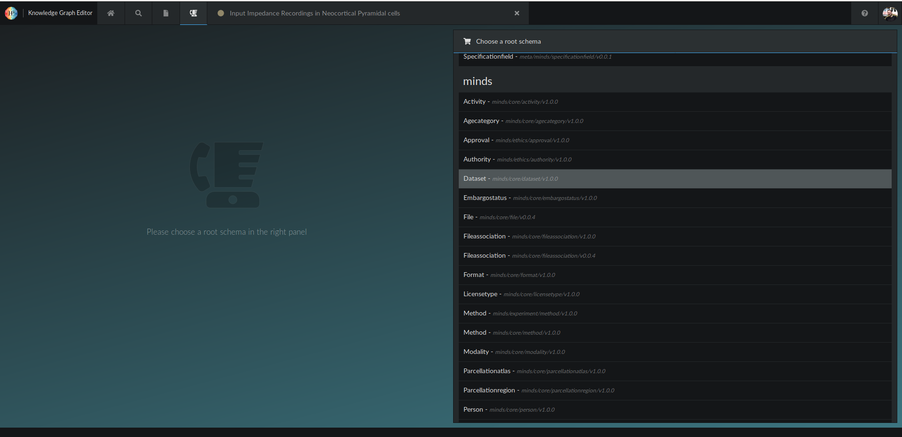
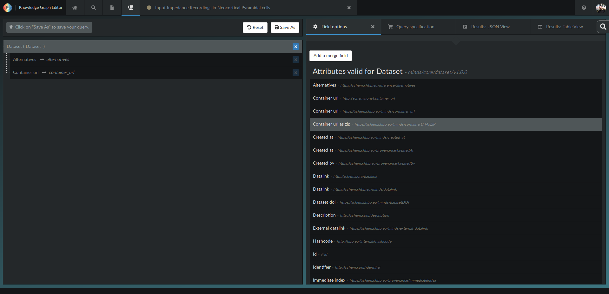
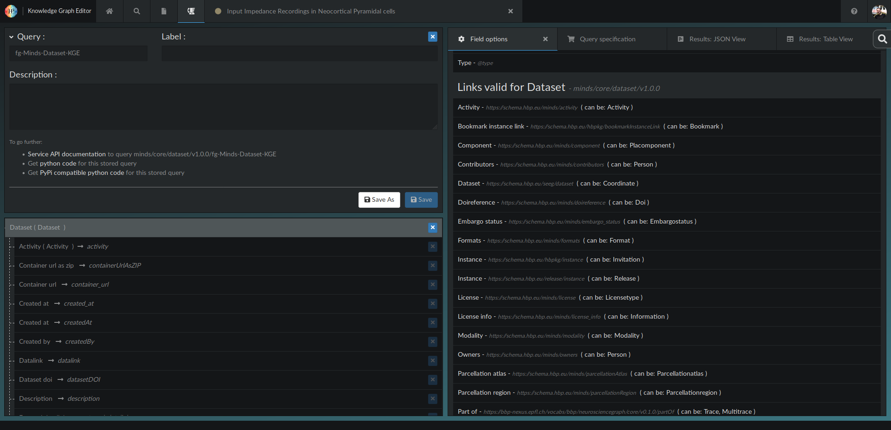

# Using the Knowledge graph Editor to build queries and namespace properties within fairgraph

We use the features of the [HBP Knowledge Graph editor](https://kg.humanbrainproject.org/editor) to build the queries and the namespace properties (e.g. its classes) within fairgraph.

Vocabulary:

- "Namespaces" refer to the different root schema considered: "Minds", "Uniminds", "Neuralactivity", ... 
- "Classes" refer to the different entries of a given namespace: e.g. for the minds schema: "Dataset", "Person", ...
 - "Attributes" are the properties of the entries of a given class. E.g. a Dataset has the attributes: "name", "contributors", "identifier", ...
 
All those objects need to be included into "faigraph". We detail here the procedure 

 
## 1) Build a general query with the KG editor for a given Namespace and a given Class of interest

Let's build a general query for the case of the "Minds" namespace for the "Dataset" class.

Within the [Knowledge Graph editor](https://kg.humanbrainproject.org/editor), we select the [query-builder](https://kg.humanbrainproject.org/editor/query-builder).

We scroll over the root schema to find the "Minds" namepsace, and then we select the "Dataset" class within the "Minds" namespace.

Then we add all "Attributes" of the class to the 

In "Results JSON view", set the size to a large value (e.g. size=20000)

Then we save the query using the following format:
"fg-Namespace-Class-KGE", e.g. for that example

The stored query should therefore appear in the following address:

https://kg.humanbrainproject.org/query/minds/core/dataset/v1.0.0/fg-Minds-Dataset-KGE

## 2) Repeat for all Namespaces and Classes of interest

Here is a few combinations:

Uniminds-Dataset

## 3) Run the script to convert the KGE queries into "fairgraph-compatible" queries

The fairgraph-compatible query should now appear in:
https://kg.humanbrainproject.org/query/minds/core/dataset/v1.0.0/fg-Minds-Dataset

## 4) Add a set of custom queries for each class

## 5) Try it out
